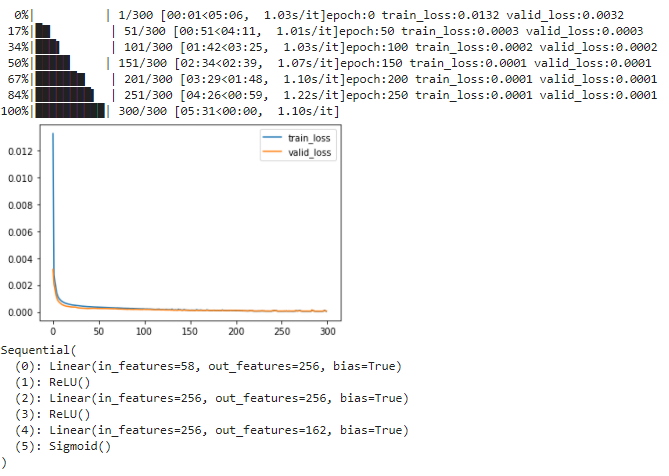

# autorch auto + pytorch Make modeling easy

## Overview

If you just want to model quickly
First, you must prepare data like pandas.DataFrame
Then define x_col (feature), y_col (label) and then:

```python
part1 = part.PartBulider(df,x_col,y_col)
part1.train()
part1.test()
```

This will automatically perform the entire data modeling process internally, using the pytorch framework



## Installation

We have tested `autorch` on Python 3.6 & 3.7.

```bash
pip install autorch
```

## Citing autorch

If you use autorch in your work, please cite the accompanying

```bibtex
@article{skywalker0803r2020autorch,
    title={autorch: A modeling Framework make modeling eazy},
    author={skywalker0803r},
    year={2020},
    url={https://github.com/skywalker0803r/autorch},
}
```
